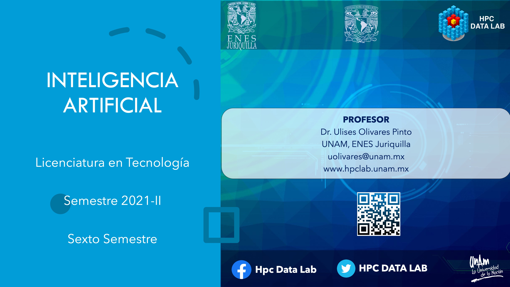

# Licenciatura en Tecnología - Inteligencia Artificial
## Semestre 2021-2

## Profesor
Dr. Ulises Olivares Pinto

## Objetivo
El estudiante analizará, comprenderá e implementará algoritmos de aprendizaje supervisado, no supervisado e implementará estos algoritmos para la resolución de problemas.

## Código en Clase
